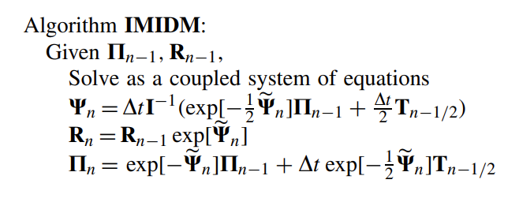
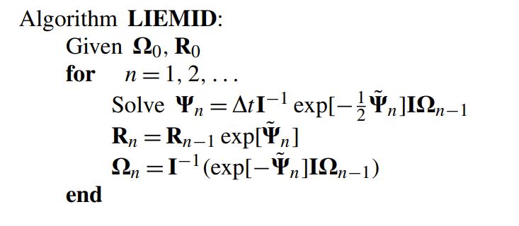
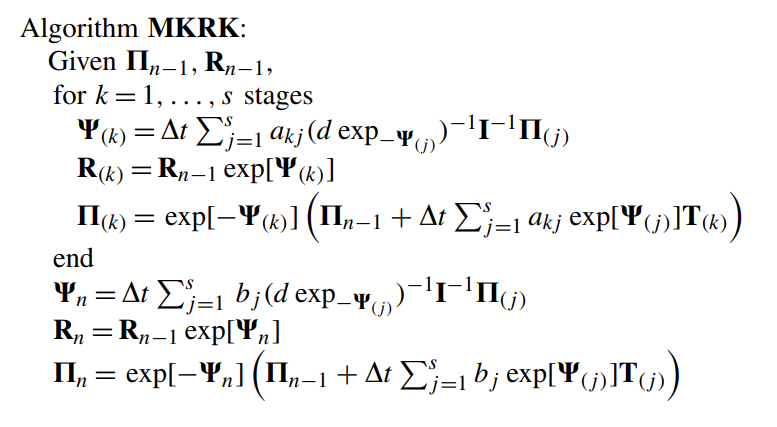
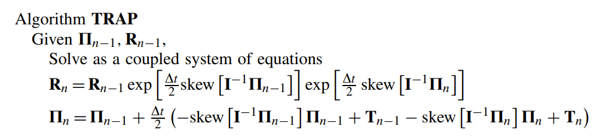
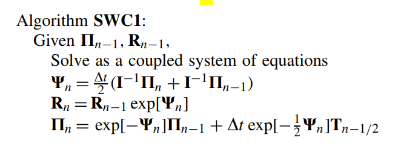
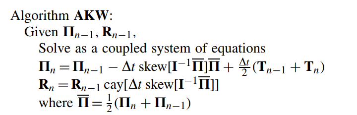
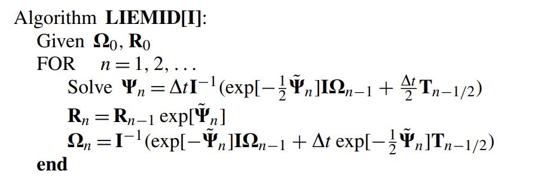
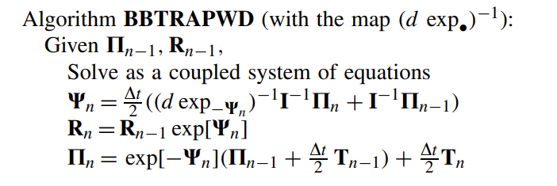

$$
\newcommand{\dt}{\Delta t \,}
\newcommand{\VelocL}{\bm{w}}
\newcommand{\VelocR}{\bm{\omega}}
\newcommand{\DisplR}{\bm{\Lambda}}
$$

## Explicit

### SVQ-VLN (ELN)

$$
\left\{\begin{aligned}
\boldsymbol{\Omega}_{k+\frac{1}{2}} & =\boldsymbol{\Omega}_k+\frac{h}{2} \mathbf{J}^{-1}\left(\mathbf{J} \boldsymbol{\Omega}_k \times \boldsymbol{\Omega}_k+\boldsymbol{\tau}\left(\mathbf{Q}_k\right)\right) \\
\mathbf{Q}_{k+1} & =\mathbf{Q}_k \operatorname{cay}\left(\dt \boldsymbol{\Omega}_{k+\frac{1}{2}}\right), \\
\boldsymbol{\Omega}_{k+1} & =\boldsymbol{\Omega}_{k+\frac{1}{2}}+\tfrac{1}{2} \dt \mathbf{J}^{-1}\left(\mathbf{J} \boldsymbol{\Omega}_{k+1} \times \boldsymbol{\Omega}_{k+1}+\tau\left(\mathbf{Q}_{k+1}\right)\right)
\end{aligned}\right.
$$

### SVQ-TLN

$$
\left\{\begin{array}{l}
\left(I+\frac{h}{2} \widehat{\boldsymbol{\Omega}}_{k+1}\right) \mathbf{J} \boldsymbol{\Omega}_{k+1}-\frac{h}{2} \boldsymbol{\tau}\left(\mathbf{Q}_{k+1}\right)=\left(I-\frac{h}{2} \widehat{\boldsymbol{\Omega}}_k\right) \mathbf{J} \boldsymbol{\Omega}_k+\frac{h}{2} \boldsymbol{\tau}\left(\mathbf{Q}_k\right), \\
\mathbf{Q}_{k+1}=\mathbf{Q}_k \operatorname{cay}\left(h \frac{\boldsymbol{\Omega}_k+\boldsymbol{\Omega}_{k+1}}{2}\right) .
\end{array}\right.
$$

### TRAP

### `RKMK`

### `LIEMID`

### `LIEMID[I]` (`IMIDM`)

RKMK with tableau:
$$
\begin{array}{c|c}
1 / 2 & 1 / 2 \\
\hline & 1
\end{array}
$$

---------

### `RKMK-TRAP`

$$
\left\{\begin{array}{l}
\boldsymbol{\omega}_{k+\frac{1}{2}}=\boldsymbol{\omega}_k+\frac{h}{2} \boldsymbol{J}^{-1}\left(\tau\left(\mathbf{R}_k\right)-\boldsymbol{\omega}_{k+\frac{1}{2}} \times \mathbf{J} \boldsymbol{\omega}_{k+\frac{1}{2}}\right) \\
\mathbf{R}_{k+1}=\mathbf{R}_k \operatorname{cay}\left(\dt  \boldsymbol{\omega}_{k+\frac{1}{2}}\right) \\
\boldsymbol{\omega}_{k+1}=\boldsymbol{\omega}_{k+\frac{1}{2}}+\frac{h}{2} \mathbf{J}^{-1}\left(\tau\left(\mathbf{R}_{k+1}\right)-\boldsymbol{\omega}_{k+\frac{1}{2}} \times \mathbf{J} \boldsymbol{\omega}_{k+\frac{1}{2}}\right)
\end{array}\right.
$$

### `VLV`

$$
\left\{\begin{array}{l}
\boldsymbol{\omega}_{k+\frac{1}{2}}=\boldsymbol{\omega}_k+\frac{h}{2} \mathbf{J}^{-1}\left[\mathbf{J} \boldsymbol{\omega}_{k+\frac{1}{2}} \times \boldsymbol{\omega}_{k+\frac{1}{2}}-\frac{h}{2}\left(\boldsymbol{\omega}_{k+\frac{1}{2}}^T \mathbf{J} \boldsymbol{\omega}_{k+\frac{1}{2}}\right) \boldsymbol{\omega}_{k+\frac{1}{2}}+\tau\left(\mathbf{R}_k\right)\right] \\
\mathbf{R}_{k+1}=\mathbf{R}_k \operatorname{cay}\left(h \boldsymbol{\omega}_{k+\frac{1}{2}}\right) \\
\boldsymbol{\omega}_{k+1}=\boldsymbol{\omega}_{k+\frac{1}{2}}+\frac{h}{2} \mathbf{J}^{-1}\left[\mathbf{J} \boldsymbol{\omega}_{k+\frac{1}{2}} \times \boldsymbol{\omega}_{k+\frac{1}{2}}+\frac{h}{2}\left(\boldsymbol{\omega}_{k+\frac{1}{2}}^T \mathbf{J} \boldsymbol{\omega}_{k+\frac{1}{2}}\right) \boldsymbol{\omega}_{k+\frac{1}{2}}+\tau\left(\mathbf{R}_{k+1}\right)\right]
\end{array}\right.
$$
Solve:
$$
f(\boldsymbol{\omega})=-\boldsymbol{\omega}+\boldsymbol{\omega}_{k+\frac{1}{2}}+\frac{h}{2}\left[(\mathbf{J} \boldsymbol{\omega}) \times \boldsymbol{\omega}-\tfrac{1}{2} \dt \left(\boldsymbol{\omega}^{T} \mathbf{J} \boldsymbol{\omega}\right) \boldsymbol{\omega}+\tau(\mathbf{R})\right]
$$
with Jacobian:
$$
J_f(\boldsymbol{\omega})=-\mathbf{I}+\frac{h}{2} \mathbf{J}^{-1}\left[(\mathbf{J} \boldsymbol{\omega})^{\wedge}-\hat{\boldsymbol{\omega}} \mathbf{J}-h \xi \boldsymbol{\omega}^T \mathbf{J}-\frac{h}{2}\left(\boldsymbol{\omega}^T \mathbf{J} \boldsymbol{\omega}\right) \mathbf{I}\right]
$$

### `LIEMID[EA]`

$$
\left\{\begin{aligned}
\boldsymbol{\Theta}_{k+\frac{1}{2}} & =\frac{h}{2} \mathbf{J}^{-1} \exp \left(-\frac{1}{2} \boldsymbol{\Theta}_{k+\frac{1}{2}}\right)\left(\mathbf{J} \boldsymbol{\Omega}_k+\frac{h}{2} \boldsymbol{\tau}\left(\mathbf{Q}_k\right)\right) \\
\mathbf{Q}_{k+\frac{1}{2}} & =\mathbf{Q}_k \exp \left(\boldsymbol{\Theta}_{k+\frac{1}{2}}\right), \\
\boldsymbol{\Omega}_{k+\frac{1}{2}} & =\mathbf{J}^{-1} \exp \left(-\boldsymbol{\Theta}_{k+\frac{1}{2}}\right)\left(\mathbf{J} \boldsymbol{\Omega}_k+\frac{h}{2} \boldsymbol{\tau}\left(\mathbf{Q}_k\right)\right), \\
\boldsymbol{\Theta}_{k+1} & =\frac{h}{2} \mathbf{J}^{-1} \exp \left(-\frac{1}{2} \boldsymbol{\Theta}_{k+1}\right) \mathbf{J} \boldsymbol{\Omega}_{k+\frac{1}{2}}, \\
\mathbf{Q}_{k+1} & =\mathbf{Q}_{k+\frac{1}{2}} \exp \left(\boldsymbol{\Theta}_{k+1}\right), \\
\boldsymbol{\Omega}_{k+1} & =\mathbf{J}^{-1}\left(\exp \left(-\boldsymbol{\Theta}_{k+1}\right) \mathbf{J} \boldsymbol{\Omega}_{k+\frac{1}{2}}+\frac{h}{2} \boldsymbol{\tau}\left(\mathbf{Q}_{k+1}\right)\right),
\end{aligned}\right.
$$

---------------

bb_rkmk_trap
bb_rkmk_trap_wdexp
dyneq_imid
dyneq_imidm
dyneq_trap
dyneq_trapm
dyneq_trapm_zeta
IncrSO3_AKW
LIEMIDEA
liemid_Newmark
mleok
rotint_nmb
simo_wong_algo_c1
simo_wong_algo_c2
SVQ
VLV
